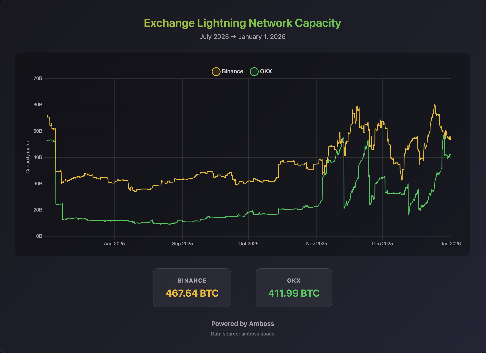

# Lightning Capacity Chart

This fetches Lightning Network node capacity metrics from the [Amboss](https://amboss.space) API and generates an HTML chart.

## Configuration

Edit `.env` to configure:

```env
# Node 1 Configuration
PUBKEY1=03a1f3afd646d77bdaf545cceaf079bab6057eae52c6319b63b5803d0989d6a72f
NAME1=Pubkey1

# Node 2 Configuration
PUBKEY2=0294ac3e099def03c12a37e30fe5364b1223fd60069869142ef96580c8439c2e0a
NAME2=Pubkey2

# Date Range (YYYY-MM-DD format)
FROM_DATE=2025-07-01
TO_DATE=2025-12-31
```

## Setup

```bash
cp .env.example .env
pnpm i && pnpm run dev
```

This will:
1. Generate `capacity-chart.html` in the project root
2. Automatically open it in your default browser

## Data Source

All data is fetched from [Amboss Space](https://docs.amboss.tech/developer).

## Screenshots

